# DoS & DDoS Attack Fundamentals — Kali Linux & Metasploitable Lab

Traffic Analysis • Wireshark • hping3 • Bash & Python Automation • TCP/IP

       
 
---
## Information

| Field      | Value                                                          |
| ---------- | -------------------------------------------------------------- |
| Topic      | Denial of Service (DoS) & Distributed Denial of Service (DDoS) |
| Platform   | Personal Lab/RootX                                             |
| Difficulty | Intermediate to Advanced                                       |
| Author     | Yusuf Muhammad Husayn Ramadan                                  |
| Date       | July 2, 2026                                                   |

## Objective

Document, in full technical detail, a hands-on DoS/DDoS lab built entirely with Kali Linux and Metasploitable2: attack workflows for ICMP, SYN, HTTP, TCP, and Ping-of-Death floods, a locally simulated multi-source ("DDoS") variant of each attack, full Wireshark traffic analysis for every stage, and applicable defensive measures.
>

> [!IMPORTANT] 
> This project was conducted entirely inside an isolated lab environment (Kali Linux attacking a Metasploitable2 virtual machine on a private virtual network) for educational and defensive security purposes. No attacks were performed against public or third-party systems.


> [!NOTE] 
> The "DDoS" stages in this lab simulate distributed attack volume by running multiple concurrent flood processes from the single attacking Kali host via `tmux`, rather than coordinating attacks from genuinely separate physical or virtual sources. This scope limitation is intentional and is discussed under **Future Improvements**.

---

## Repo Structure

```text
dos-ddos-lab/
├── README.md
├── LICENSE
├── .gitignore
├── images/
└── scripts/
    ├── bash/
    └── python/
```

---

## Table of Contents

1. Prerequisites
2. Introduction
3. Lab Environment
4. Network Topology
5. Lab Workflow
6. Tools & Scripts Used
7. Attack Types
    - ICMP Flood
    - SYN Flood
    - HTTP Flood
    - TCP Flood
    - Ping of Death
8. Simulated DDoS Stage
9. Combined Attack — Service Outage
10. Traffic Analysis (Wireshark)
11. Mitigation Techniques
12. Attack Summary
13. Lessons Learned
14. Future Improvements
15. Skills Demonstrated
16. Screenshots Index
17. Packet Capture Index
18. Lab Limitations
19. Conclusion
20. References

---

## 1. Prerequisites

- VMware Workstation / VirtualBox
- Kali Linux (attacker)
- Metasploitable2 (victim)
- Wireshark
- hping3
- tmux
- Python 3
- Bash

---

## 2. Introduction

A Denial of Service (DoS) attack aims to make a targeted service or infrastructure unavailable to legitimate users, by exhausting resources such as CPU, memory, or network bandwidth. Unlike data breaches, the goal is disruption, not theft.

A DoS attack originates from a single machine using a single NIC, processor, and memory pool. A Distributed Denial of Service (DDoS) attack scales this up using many sources targeting a single victim simultaneously, which increases both the traffic volume and the difficulty of mitigation. In this lab, the DDoS stage is approximated using concurrent multi-process flooding from one attacker host, run via `tmux` sessions, to observe the difference in impact and traffic signature compared to a single-stream DoS.

<p align="center">
  
</p>

<p align="center">
  <em>Figure 00. Overall lab topology showing the Kali Linux attacker, Metasploitable2 target, and Wireshark traffic capture within an isolated virtual network.</em>
</p>


---

## 3. Lab Environment

**Attacker Machine**

- Kali Linux
- hping3, tmux, Python 3, custom Bash scripts

**Victim Machine**

- Metasploitable2
- Apache2 (manually started/stopped during testing to compare service states)

**Packet Analyzer**

- Wireshark, run on the Kali host to capture traffic on the lab interface

**Network**

VMware Workstation virtual networking.

Attacker: NAT Adapter

Target: Host-Only Adapter

Connectivity was verified before every experiment.

### Addressing

The Kali Linux attacker VM was configured with a NAT network adapter for internet access and package management. The Metasploitable2 target VM was connected to an isolated host-only network for the attack demonstrations.

|Device|IP Address|
|---|---|
|Kali Linux (Attacker)|192.168.12.128 (NAT)|
|Metasploitable2 (Victim)|192.168.1.25 (Host-Only)|

Connectivity between the attacker and target virtual machines was verified before every experiment using ICMP echo requests and application-layer service checks.

### Network Notes

The lab was conducted inside VMware using isolated virtual networking. The attacker and target virtual machines were configured to communicate over the virtual network while remaining isolated from external systems.

---

## 4. Network Topology

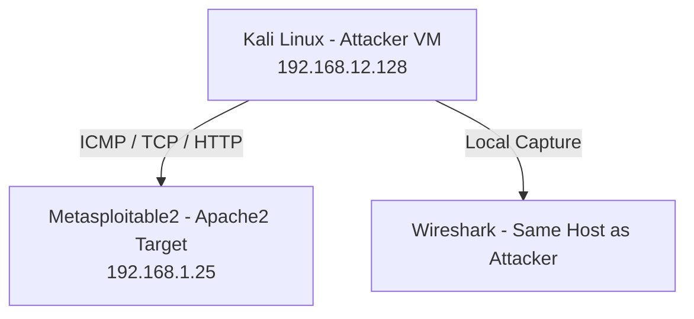

Wireshark was run locally on the Kali attacker host rather than a separate capture VM, capturing outbound attack traffic and inbound replies on the lab interface.

---

## 5. Lab Workflow


**Baseline capture** was taken before any attack traffic was generated (`01-baseline.pcapng`), so every subsequent capture could be compared against normal traffic patterns rather than analyzed in isolation.
<p align="center">
  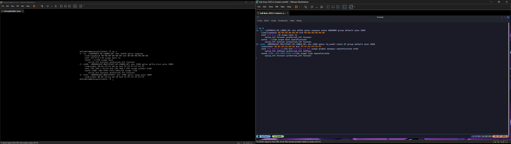
</p>

<p align="center">
  <em>Figure 01. Baseline network traffic captured before any attack activity, providing a reference for comparison.</em>
</p>

Target-side verification was performed by starting and stopping Apache2 on Metasploitable2 (`sudo /etc/init.d/apache2 start` / `stop`) and checking the listening state with `netstat -antp | grep 80` before and after each HTTP-related test, to confirm the service state independently of the attack traffic itself.

---

## 6. Tools & Scripts Used

### Kali Linux

Base attacker platform for all traffic generation and capture.

### hping3

Used to hand-craft and flood ICMP, SYN, and oversized ICMP (Ping of Death) packets.

### Wireshark

Used for live capture and post-attack analysis of every stage, filtered per protocol.

### tmux

Used to run multiple flood processes concurrently in separate panes/sessions, simulating the volume of a distributed attack from a single host. Sessions were torn down after each stage (`tmux kill-session` / `tmux kill-server`) before moving to the next attack type.

### Custom Scripts (`scripts/bash` and `scripts/python`)

|Script|Purpose|
|---|---|
|`00-icmp-ddos-script.sh`|Launches multiple concurrent ICMP flood processes via tmux to simulate distributed ICMP flood volume|
|`01-syn-ddos-script.sh`|Launches multiple concurrent SYN flood processes via tmux to simulate distributed SYN flood volume|
|`02-http-ddos-script.sh`|Launches multiple concurrent HTTP flood processes via tmux to simulate distributed HTTP flood volume|
|`03-pod-ddos-script.sh`|Launches multiple concurrent oversized-ICMP (Ping of Death style) processes via tmux|
|`04-tcp-ddos-script.sh`|Launches multiple concurrent TCP flood processes via tmux|
|`00-tcp-data-flood.py`|Python-based TCP payload flood generator|
|`01-botnet.py`|Python script coordinating multiple local flood processes to simulate a distributed source pattern against a single target|
|`02-http-ddos.py`|Python-based HTTP request generator used by the HTTP DDoS script|


> Script contents are not reproduced in this write-up; only their role in the lab workflow is documented, consistent with responsible disclosure practice for offensive tooling.

---

## 7. Attack Types

### DoS vs DDoS (as tested in this lab)

|Metric|DoS Stage|Simulated DDoS Stage|
|---|---|---|
|Source Count|Single hping3/script process|Multiple concurrent processes via tmux, same host|
|Detection Complexity|High visibility, easy to trace to one stream|Higher traffic volume, more connections/sec to correlate|
|Traffic Volume|Limited by one process/interface|Multiplied by concurrent process count|
|Real-World Equivalent|Single attacker|Approximates distributed volume, but not distributed source IPs|

### ICMP Flood

**Overview** A high volume of ICMP Echo Request packets is sent to the target. The target attempts to process and reply to each one, consuming bandwidth and network-stack CPU cycles.

**Attack Workflow**

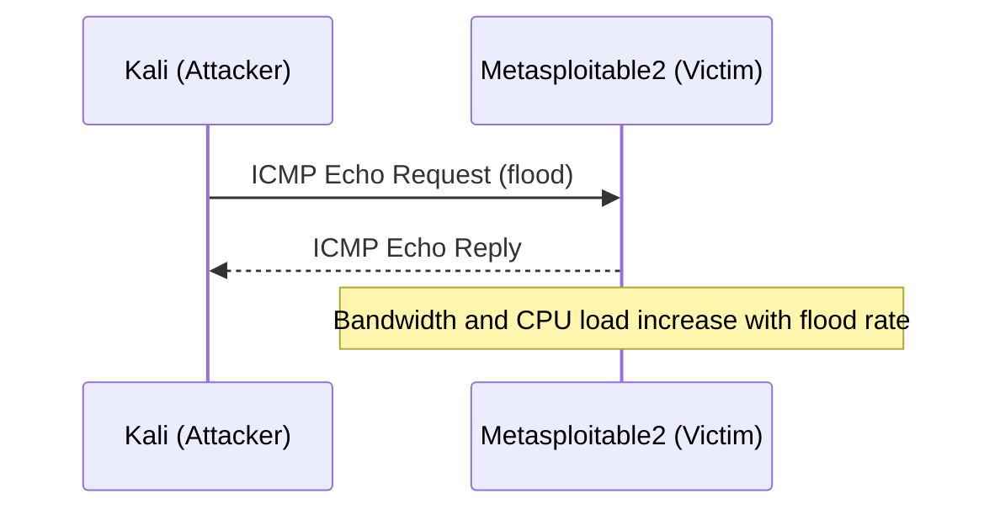

**Impact** Increased bandwidth usage and processing load on the victim's network stack, visible as a spike in the IO Graph during the attack window.

**Wireshark Analysis** <p align="center">
  
</p>

<p align="center">
  <em>Figure 02. Single-source ICMP flood captured in Wireshark, showing a continuous stream of ICMP Echo Request packets.</em>
</p>

<p align="center">
  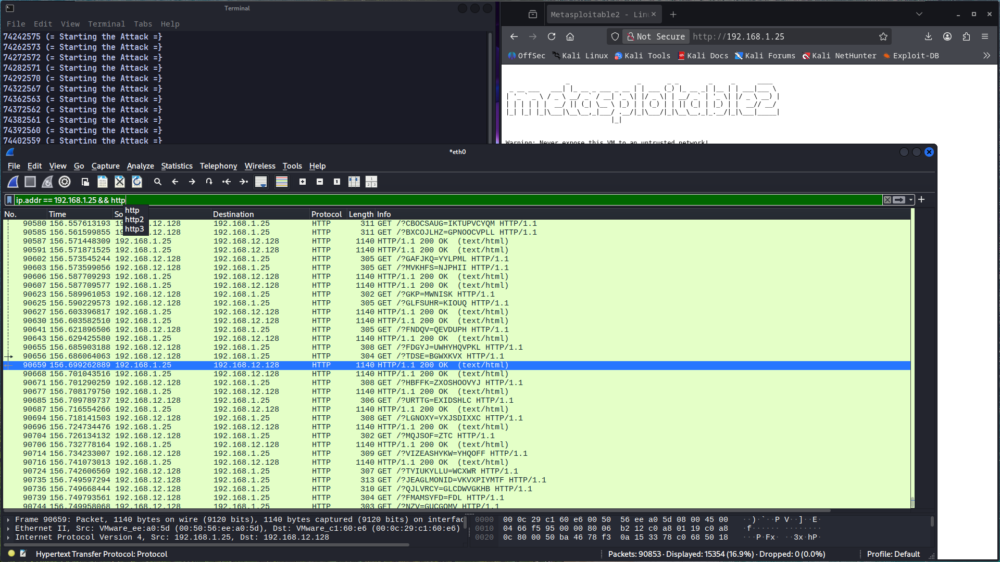
</p>

<p align="center">
  <em>Figure 03. Execution of the ICMP flood simulation script using multiple concurrent tmux sessions.</em>
</p>

<p align="center">
  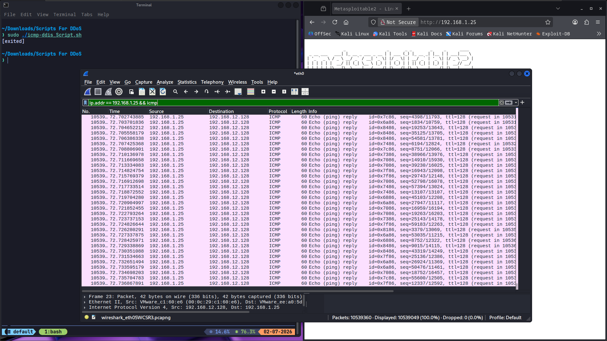
</p>

<p align="center">
  <em>Figure 04. Simulated multi-process ICMP flood producing a significantly higher packet rate than the single-source attack.</em>
</p>

**Key Findings** ICMP floods are the easiest attack type to detect and filter, since legitimate ICMP traffic volume is normally very low; the DDoS stage differs mainly in packet rate, not in signature.

---

### SYN Flood

**Overview** Exploits the TCP three-way handshake. The attacker sends a flood of SYN packets and never completes the handshake with a final ACK, leaving connections half-open until the victim's connection queue is exhausted.

**Attack Workflow**

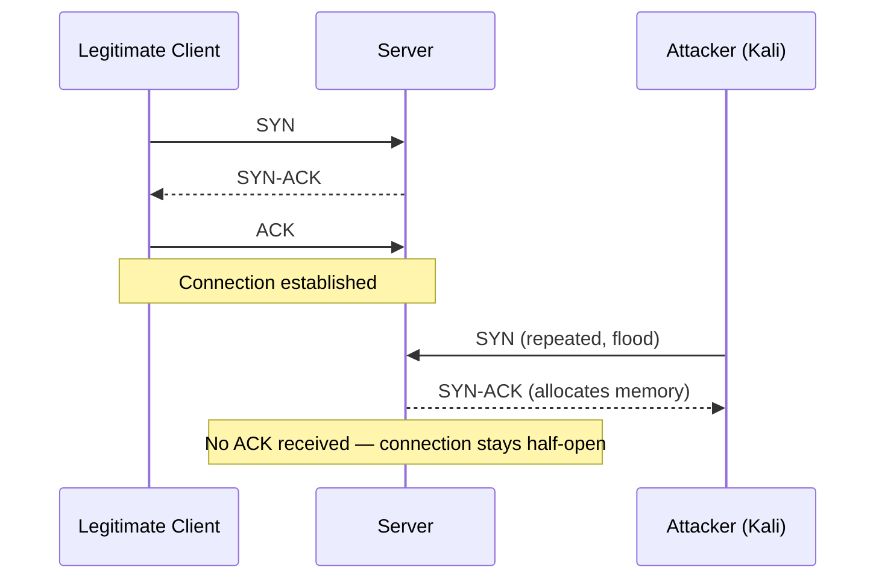

**Impact** Exhaustion of the server's connection queue, which can block or slow new legitimate connections.

**Wireshark Analysis** <p align="center">
  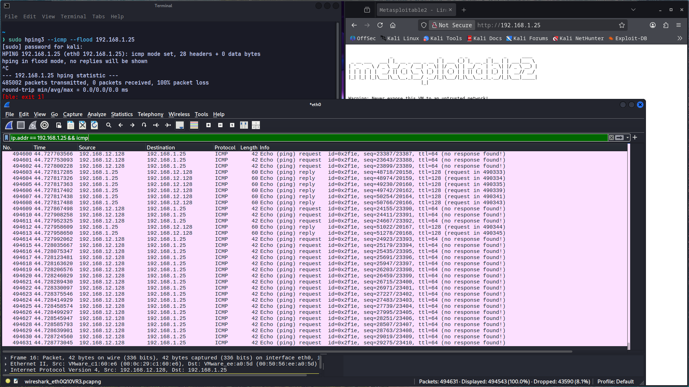
</p>

<p align="center">
  <em>Figure 05. Single-source SYN flood showing repeated SYN packets without completing the TCP three-way handshake.</em>
</p>

<p align="center">
  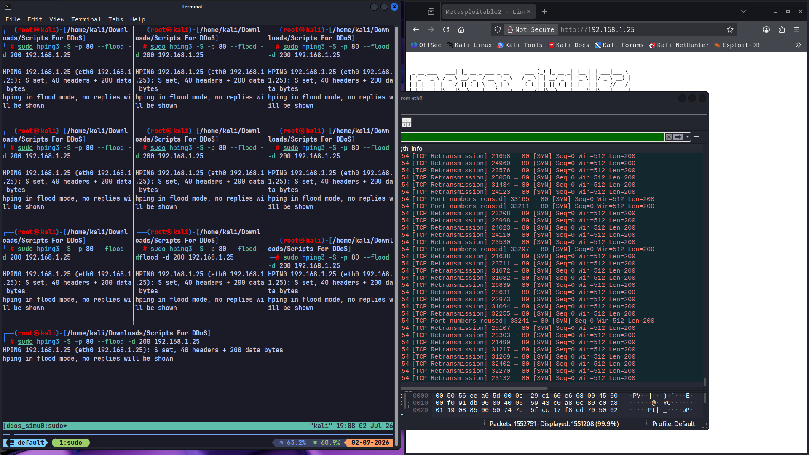
</p>

<p align="center">
  <em>Figure 06. Execution of the SYN flood simulation script across multiple concurrent processes.</em>
</p>

<p align="center">
  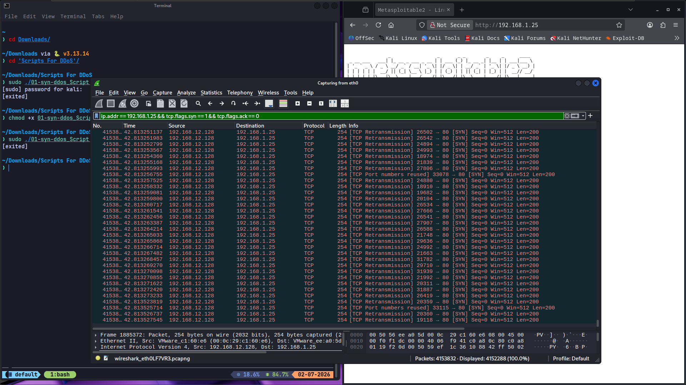
</p>

<p align="center">
  <em>Figure 07. Simulated SYN flood demonstrating an increased number of half-open TCP connections.</em>
</p>

**Key Findings** SYN floods are identifiable by the SYN/ACK asymmetry in the filtered capture and by the growing number of half-open connections over the attack window.

---

### HTTP Flood

**Overview** Targets the application layer (Layer 7) with structurally valid HTTP requests against the Apache2 service running on Metasploitable2. These requests are indistinguishable from legitimate traffic at the network layer, since the goal is to exhaust application-side resources rather than raw bandwidth.

**Attack Workflow** Repeated HTTP GET requests are sent to the target's web service. The Python-based generator (`02-http-ddos.py`) issues requests concurrently across multiple processes during the DDoS stage.

**Impact** Application-level resource pressure (Apache worker processes, connection handling) rather than pure bandwidth exhaustion. Service state was verified independently with `netstat -antp | grep 80` before, during, and after testing.

**Wireshark Analysis** <p align="center">
  
</p>

<p align="center">
  <em>Figure 08. Single-source HTTP flood showing a high rate of HTTP GET requests sent to the target web server.</em>
</p>

<p align="center">
  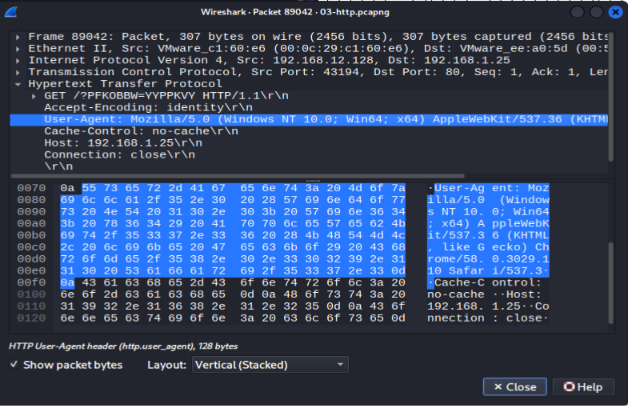
</p>

<p align="center">
  <em>Figure 09. HTTP request headers captured during the application-layer flood analysis.</em>
</p>

<p align="center">
  
</p>

<p align="center">
  <em>Figure 10. HTTP flood automation script launching multiple concurrent request generators.</em>
</p>

<p align="center">
  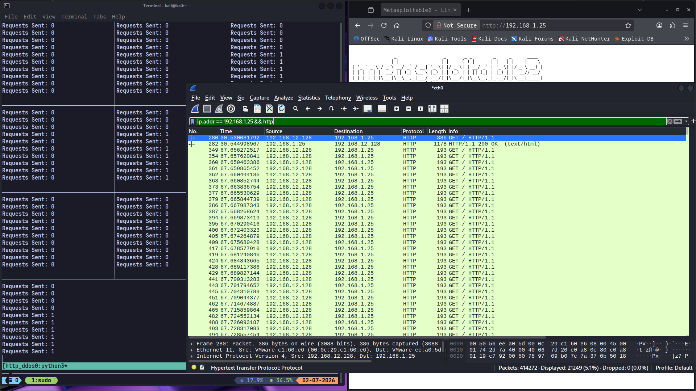
</p>

<p align="center">
  <em>Figure 11. Simulated HTTP flood generating a substantially higher request rate against the Apache2 service.</em>
</p>

**Key Findings** Layer 7 floods are the hardest attack type to distinguish from real users at the network layer alone; request-rate anomalies and connection concurrency were the clearest signals observed in this lab, rather than packet-level structure.

---

### TCP Flood

**Overview** A generic TCP-layer flood using crafted payload data (`00-tcp-data-flood.py`) to saturate the connection handling capacity of the target beyond a simple SYN flood, by establishing and holding connections with data payloads.

**Attack Workflow** The attacker opens TCP connections to the target and sends flood-rate payload data, consuming both connection slots and processing time on the victim.

**Impact** Combined bandwidth and connection-table pressure on the victim, more resource-intensive to generate than a pure SYN flood but harder for the victim to distinguish from legitimate data transfer at first glance.

**Wireshark Analysis** <p align="center">
  
</p>

<p align="center">
  <em>Figure 12. Single-source TCP flood transmitting continuous payload data to the target.</em>
</p>

<p align="center">
  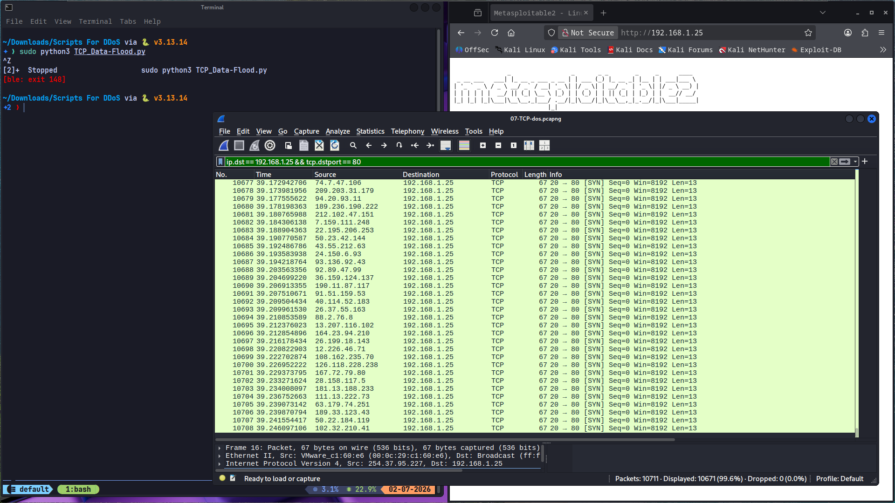
</p>

<p align="center">
  <em>Figure 13. Execution of the TCP flood simulation script across multiple concurrent processes.</em>
</p>

<p align="center">
  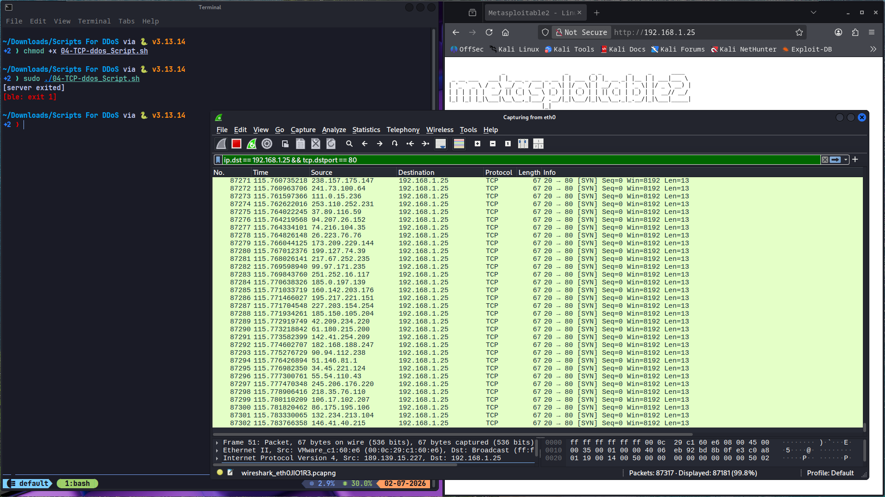
</p>

<p align="center">
  <em>Figure 14. Simulated TCP flood demonstrating increased connection volume and payload throughput.</em>
</p>

**Key Findings** TCP floods that include payload data are more resource-intensive to generate but produce traffic that looks closer to legitimate data transfer than SYN-only floods, making them slightly harder to triage from packet headers alone.

---

### Ping of Death

**Overview** Historically, oversized or malformed fragmented ICMP packets could cause buffer overflows during reassembly, crashing legacy systems. This lab reproduced the classic oversized-ICMP packet pattern (`hping3 -1 -c 10 -d 65495 -w 65495`) against the Metasploitable2 target to observe how a modern-era Linux network stack handles it.

**Attack Workflow** Oversized ICMP Echo Request packets, at or near the maximum IP packet size, were sent to the target for reassembly.

**Impact** Metasploitable2 accepted the oversized ICMP traffic without crashing. Packet captures showed that malformed fragments were discarded by the network stack, demonstrating resistance to the historical Ping of Death attack.

**Wireshark Analysis** <p align="center">
  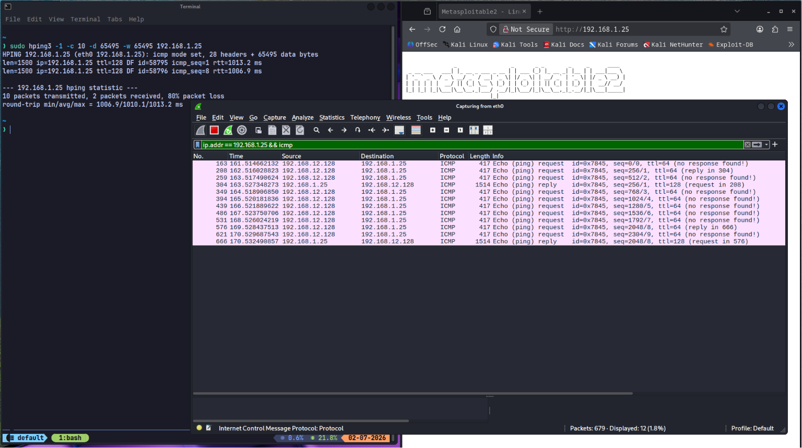
</p>

<p align="center">
  <em>Figure 15. Oversized ICMP packets generated during the Ping of Death demonstration.</em>
</p>

<p align="center">
  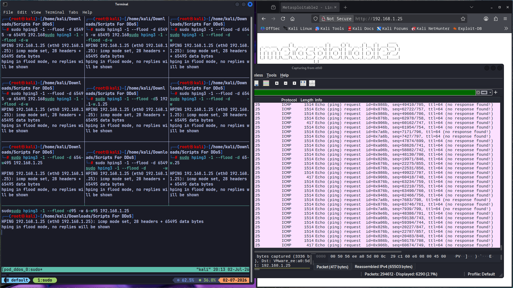
</p>

<p align="center">
  <em>Figure 16. Execution of the Ping of Death simulation script using multiple concurrent processes.</em>
</p>

<p align="center">
  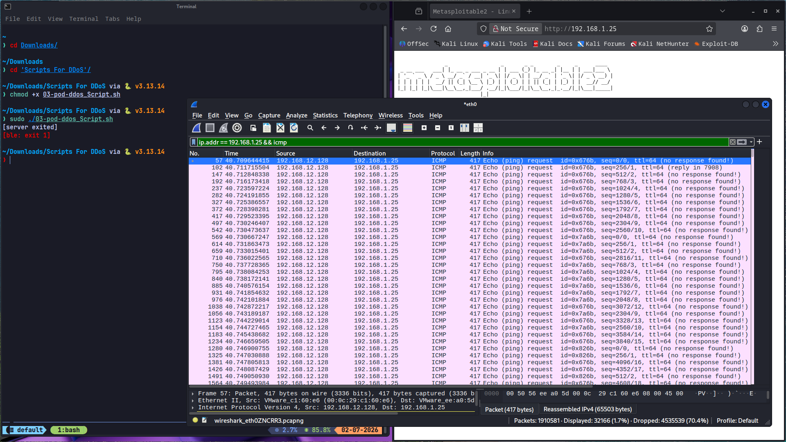
</p>

<p align="center">
  <em>Figure 17. Simulated multi-process Ping of Death traffic captured in Wireshark.</em>
</p>

**Key Findings** This attack is largely a historical case study against fully patched modern kernels, but remains a useful test against older or specifically vulnerable targets like Metasploitable2, which is intentionally left unpatched for training purposes.

Observed that Metasploitable2 dropped the malformed fragments due to modern kernel handling, confirming it is resilient against legacy PoD attacks.
---

## 8. Simulated DDoS Stage

Each attack type above was re-run using its corresponding `*-ddos-script.sh`, which opens several `tmux` panes and launches one flood process per pane against the same target simultaneously. This approximates the traffic _volume_ of a distributed attack while originating from a single source IP — a meaningful distinction from a genuine multi-host DDoS, and one worth stating clearly in a graduation project defense.

Each DDoS-stage script was terminated cleanly after capture with `tmux kill-session -t ddos_simulation` (or `tmux kill-server` where multiple sessions were used), before moving to the next attack type, to avoid cross-contaminating captures between stages.

---

## 9. Combined Attack — Service Outage

As a final demonstration, multiple attack types were run in combination against Metasploitable2 to observe cumulative impact on service availability.

<p align="center">
  
</p>

<p align="center">
  <em>Figure 18. Combined attack scenario resulting in degraded Apache2 service availability on the target system.</em>
</p>

During the combined attack, the Apache2 service became temporarily unavailable to legitimate clients within seconds. Recovery was achieved by terminating the flood processes, with service restoration confirmed using `netstat`.

---

## 10. Traffic Analysis (Wireshark)

### Filters Used

|Purpose|Filter|
|---|---|
|ICMP|`ip.addr == 192.168.1.25 && icmp`|
|SYN|`ip.addr == 192.168.1.25 && tcp.flags.syn == 1 && tcp.flags.ack == 0`|
|HTTP|`ip.addr == 192.168.1.25 && http`|
|Post-Attack Port State|`ip.dst == 192.168.1.25 && tcp.dstport == 80`|
|TCP Retransmission|`tcp.analysis.retransmission`|
|Conversations|Statistics > Conversations|

### Statistics Views Used

- Conversations
- Endpoints
- IO Graph
- Protocol Hierarchy

### Packet Captures

Every stage was saved to a dedicated `.pcapng` file so the traffic can be independently re-analyzed:

```text
Packet capture files

00-baseline.pcapng
01-icmp-dos.pcapng
       •••
10-tcp-ddos.pcapng
```

---

## 11. Mitigation Techniques

### Service-Level Defense (Apache2 / Metasploitable-style targets)

- **mod_evasive / mod_security:** Apache modules that detect and throttle abusive request patterns at the application layer.
- **Connection/keep-alive tuning:** lowering `Timeout` and `MaxKeepAliveRequests` reduces how long a single flood connection can hold a worker slot.
- **fail2ban:** automatically bans source IPs generating abnormal connection or error rates.

### Edge Defense

- **Firewalls & IPS:** drop volumetric patterns like unrequested ICMP floods and excessive half-open connections at the perimeter.
- **Rate limiting:** cap requests per source IP over a time window (e.g. via `iptables` `hashlimit` or a reverse proxy).
- **SYN cookies:** kernel-level mitigation (`net.ipv4.tcp_syncookies`) that avoids allocating memory for half-open connections until the handshake completes.

### Cloud-Based Scrubbing

For internet-facing production services, routing traffic through a cloud defense network filters malicious packets before they reach the origin server:

- Cloudflare
- AWS Shield
- Azure DDoS Protection

---

## 12. Attack Summary

|Attack|Layer|Target|Effect|
|---|---|---|---|
|ICMP Flood|L3|Network|Bandwidth/CPU exhaustion|
|SYN Flood|L4|TCP stack|Half-open connection exhaustion|
|HTTP Flood|L7|Apache2|Application resource exhaustion|
|TCP Flood|L4|TCP stack|Connection + bandwidth exhaustion|
|Ping of Death|L3|Network stack|Legacy buffer overflow (mitigated on modern kernels)|

---

## 13. Lessons Learned

- TCP handshakes are inherently vulnerable to resource exhaustion without SYN-cookie style protection.
- ICMP and SYN floods are easy to identify in packet captures via simple filters; HTTP floods are not.
- Simulated multi-process flooding from a single host meaningfully increases traffic volume and impact compared to a single stream, even without true source distribution.
- `tmux` is an effective way to orchestrate and cleanly tear down multiple concurrent attack processes during controlled testing.
- Comparing captures against a genuine baseline made every subsequent anomaly easier to identify with confidence.

---

## 14. Future Improvements

- Repeat the DDoS stage using genuinely separate attacking VMs/hosts instead of a single-host simulation, to compare traffic signatures against distributed source IPs.
- Deploy `mod_evasive` or a WAF in front of Metasploitable2 and re-run the HTTP flood to measure mitigation effectiveness quantitatively.
- Analyze the same captures with Zeek and compare detection against manual Wireshark filtering.
- Evaluate Suricata/Snort signatures against the saved `.pcapng` files.
- Add response-time/latency measurements (e.g. `curl -w`) captured during each attack stage as a quantitative impact metric.

---

## 15. Skills Demonstrated

- Network Traffic Analysis
- Wireshark Packet Inspection & Filtering
- TCP/IP Protocol Analysis
- HTTP Analysis
- Linux System & Service Administration (Apache2, netstat)
- Bash Scripting & Process Orchestration (tmux)
- Python Scripting for Traffic Generation
- Vulnerable-Service Lab Setup (Metasploitable2)
- Defensive Security & Mitigation Planning

---

## 16. Screenshots Index

|#|File|Description|
|---|---|---|
|00|`00-topology.png`|Lab Topology|
|01|`01-baseline.png`|Baseline Traffic Capture|
|02|`02-icmp-dos.png`|ICMP Flood — Single Source|
|03|`03-icmp-ddos-script.png`|ICMP DDoS Script Execution|
|04|`04-icmp-ddos.png`|ICMP Flood — Simulated Multi-Source|
|05|`05-syn-dos.png`|SYN Flood — Single Source|
|06|`06-syn-ddos-script.png`|SYN DDoS Script Execution|
|07|`07-syn-ddos.png`|SYN Flood — Simulated Multi-Source|
|08|`08-http-dos.png`|HTTP Flood — Single Source|
|09|`09-http-headers.png`|Captured HTTP Headers|
|10|`10-http-ddos-script.png`|HTTP DDoS Script Execution|
|11|`11-http-ddos.png`|HTTP Flood — Simulated Multi-Source|
|12|`12-tcp-dos.png`|TCP Flood — Single Source|
|13|`13-tcp-ddos-script.png`|TCP DDoS Script Execution|
|14|`14-tcp-ddos.png`|TCP Flood — Simulated Multi-Source|
|15|`15-pod-dos.png`|Ping of Death — Single Source|
|16|`16-pod-ddos-script.png`|Ping of Death DDoS Script Execution|
|17|`17-pod-ddos.png`|Ping of Death — Simulated Multi-Source|
|18|`18-combined-attack.png`|Combined Attack — Service Outage|

---

## 17. Packet Capture Index

> [!NOTE]
> The raw packet capture files generated during this project are not stored in this repository because the complete capture set exceeds GitHub's practical repository size limits.
>
> **Download the complete PCAP collection:**
>
> https://drive.google.com/drive/folders/1-iTdr49YMJAuqd9PS4xHblitj7w09v_2?usp=sharing

|File|Stage|
|---|---|
|`00-baseline.pcapng`|Pre-attack baseline traffic|
|`01-icmp-dos.pcapng`|ICMP Flood — single source|
|`02-syn-dos.pcapng`|SYN Flood — single source|
|`03-http-dos.pcapng`|HTTP Flood — single source|
|`04-pod-dos.pcapng`|Ping of Death — single source|
|`05-icmp-ddos.pcapng`|ICMP Flood — simulated multi-source|
|`06-syn-ddos.pcapng`|SYN Flood — simulated multi-source|
|`07-http-ddos.pcapng`|HTTP Flood — simulated multi-source|
|`08-pod-ddos.pcapng`|Ping of Death — simulated multi-source|
|`09-tcp-dos.pcapng`|TCP Flood — single source|
|`10-tcp-ddos.pcapng`|TCP Flood — simulated multi-source|

---

## 18. Lab Limitations

This laboratory simulated DoS and DDoS behavior within an isolated VMware environment.

The attacks were generated from a single Kali Linux host using multiple concurrent processes rather than a geographically distributed botnet.

As expected, the experiments demonstrated service degradation and temporary application-layer unavailability instead of a complete operating system crash.

This behavior accurately reflects the objective of DoS/DDoS testing in a controlled educational environment, where the primary goal is to exhaust application and network resources rather than permanently disable the target operating system.

The objective of the laboratory was to analyze attack behavior, traffic characteristics, and defensive techniques rather than reproduce Internet-scale DDoS attacks.

## 19. Conclusion

This project built a complete, self-contained DoS/DDoS lab using only Kali Linux and Metasploitable2, covering five distinct attack primitives — ICMP flood, SYN flood, HTTP flood, TCP flood, and Ping of Death — each tested first as a single-source DoS and then as a locally simulated multi-process DDoS via `tmux`. Every stage was captured independently in Wireshark and compared against a clean baseline, allowing clear identification of each attack's traffic signature at Layer 3, 4, and 7. A combined-attack stage demonstrated cumulative impact on service availability. The project closes with a concrete, honest limitation — the DDoS stage simulates volume rather than true source distribution — and a set of practical next steps (multi-host testing, WAF deployment, IDS signature evaluation) to extend the work further.

---

## 20. References

- [OWASP Testing Guide — Denial of Service Methodology](https://owasp.org/www-community/attacks/Denial_of_Service)
- [CISA & MS-ISAC Joint Guide — Understanding and Responding to DDoS Attacks](https://www.cisa.gov/resources-tools/resources/understanding-and-responding-distributed-denial-service-attacks)
- [Cloudflare Learning Center — Layer 7 vs Layer 4 Mitigation](https://www.cloudflare.com/learning/ddos/what-is-a-ddos-attack/)
- [Imperva Distributed Denial of Service (DDoS)](https://www.imperva.com/learn/ddos/denial-of-service/)
- [Wireshark Documentation](https://www.wireshark.org/docs/)
- [Metasploitable2 Documentation](https://docs.rapid7.com/metasploit/metasploitable-2-exploitability-guide/)
- [hping3 Manual (`man hping3`)](https://linux.die.net/man/8/hping3)

### Additional Learning Resources

- [How to Perform a DDoS Attack Using Kali Linux | Educational Tutorial](https://youtu.be/mGAd_bOri18?si=hn5R2VOMuFT4JIt8)
- [DDoS Attack Explained | How to Perform DOS Attack | Ethical Hacking and Penetration Testing](https://youtu.be/04M8X-im3ac?si=e8yiqXIU-xPyy2nE)
- [How to Install Metasploitable on New VMware Workstation](https://youtu.be/OO7BPfi3DbU?si=OQJc4CRLsBHsmi2X)
- [i bought a DDoS attack on the DARK WEB (don't do this)](https://youtu.be/eZYtnzODpW4?si=GXrN3MXsielkWkGg)

If you found this project useful, feel free to star the repository.
