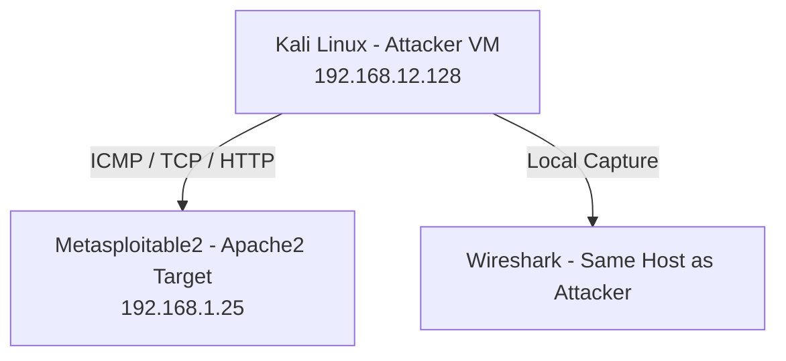
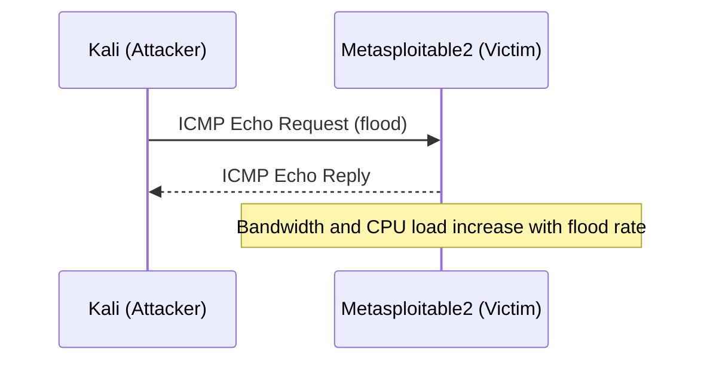
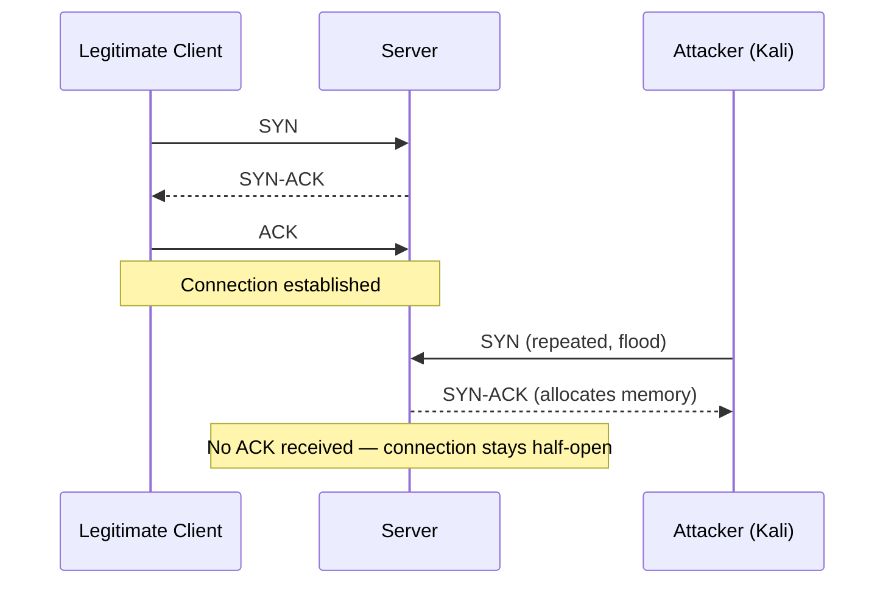

# DoS & DDoS Attack Fundamentals — Kali Linux & Metasploitable Lab

Traffic Analysis • Wireshark • hping3 • Bash & Python Automation • TCP/IP

   

---
## Information

| Field      | Value                                                          |
| ---------- | -------------------------------------------------------------- |
| Topic      | Denial of Service (DoS) & Distributed Denial of Service (DDoS) |
| Platform   | Personal Lab/RootX                                             |
| Difficulty | Hard                                                           |
| Author     | Yusuf Muhammad Husayn Ramadan                                  |
| Date       | 02/07/2026                                                     |

## Objective

Document, in full technical detail, a hands-on DoS/DDoS lab built entirely with Kali Linux and Metasploitable2: attack workflows for ICMP, SYN, HTTP, TCP, and Ping-of-Death floods, a locally simulated multi-source ("DDoS") variant of each attack, full Wireshark traffic analysis for every stage, and applicable defensive measures.
>

> [!IMPORTANT] 
> This project was conducted entirely inside an isolated lab environment (Kali Linux attacking a Metasploitable2 virtual machine on a private virtual network) for educational and defensive security purposes. No attacks were performed against public or third-party systems.


> [!NOTE] 
> The "DDoS" stages in this lab simulate distributed attack volume by running multiple concurrent flood processes from the single attacking Kali host via `tmux`, rather than coordinating attacks from genuinely separate physical or virtual sources. This scope limitation is intentional and is discussed under **Future Improvements**.

---

## Folder Structure

```text
DoS-DDoS-Lab/
├── README.md
├── LICENSE
├── .gitignore
├── images/
├── pcaps/
├── scripts/
│   └── Scripts For DDoS/
├── reports/
└── references/
```

---

## Table of Contents

1. Prerequisites
2. Introduction
3. Lab Environment
4. Network Topology
5. Lab Workflow
6. Tools & Scripts Used
7. Attack Types
    - ICMP Flood
    - SYN Flood
    - HTTP Flood
    - TCP Flood
    - Ping of Death
8. Simulated DDoS Stage
9. Combined Attack — Service Outage
10. Traffic Analysis (Wireshark)
11. Mitigation Techniques
12. Attack Summary
13. Lessons Learned
14. Future Improvements
15. Skills Demonstrated
16. Screenshots Index
17. Packet Capture Index
18. Conclusion
19. References

---

## 1. Prerequisites

- VMware Workstation / VirtualBox
- Kali Linux (attacker)
- Metasploitable2 (victim)
- Wireshark
- hping3
- tmux
- Python 3
- Bash

---

## 2. Introduction

A Denial of Service (DoS) attack aims to make a targeted service or infrastructure unavailable to legitimate users, by exhausting resources such as CPU, memory, or network bandwidth. Unlike data breaches, the goal is disruption, not theft.

A DoS attack originates from a single machine using a single NIC, processor, and memory pool. A Distributed Denial of Service (DDoS) attack scales this up using many sources targeting a single victim simultaneously, which increases both the traffic volume and the difficulty of mitigation. In this lab, the DDoS stage is approximated using concurrent multi-process flooding from one attacker host, run via `tmux` sessions, to observe the difference in impact and traffic signature compared to a single-stream DoS.

 _Figure 00: Overall lab topology — Kali Linux attacking a Metasploitable2 target on an isolated virtual network._


---

## 3. Lab Environment

**Attacker Machine**

- Kali Linux
- hping3, tmux, Python 3, custom Bash scripts

**Victim Machine**

- Metasploitable2
- Apache2 (manually started/stopped during testing to compare service states)

**Packet Analyzer**

- Wireshark, run on the Kali host to capture traffic on the lab interface

**Network**

- Isolated virtual lab segment, host-only / NAT network with no internet-facing hosts

### Addressing

|Device|IP Address|
|---|---|
|Kali Linux (Attacker)|192.168.12.128|
|Metasploitable2 (Victim)|192.168.1.25|

---

## 4. Network Topology



Wireshark was run locally on the Kali attacker host rather than a separate capture VM, capturing outbound attack traffic and inbound replies on the lab interface.

---

## 5. Lab Workflow


**Baseline capture** was taken before any attack traffic was generated (`01-baseline.pcapng`), so every subsequent capture could be compared against normal traffic patterns rather than analyzed in isolation.

Target-side verification was performed by starting and stopping Apache2 on Metasploitable2 (`sudo /etc/init.d/apache2 start` / `stop`) and checking the listening state with `netstat -antp | grep 80` before and after each HTTP-related test, to confirm the service state independently of the attack traffic itself.

---

## 6. Tools & Scripts Used

### Kali Linux

Base attacker platform for all traffic generation and capture.

### hping3

Used to hand-craft and flood ICMP, SYN, and oversized ICMP (Ping of Death) packets.

### Wireshark

Used for live capture and post-attack analysis of every stage, filtered per protocol.

### tmux

Used to run multiple flood processes concurrently in separate panes/sessions, simulating the volume of a distributed attack from a single host. Sessions were torn down after each stage (`tmux kill-session` / `tmux kill-server`) before moving to the next attack type.

### Custom Scripts (`Scripts For DDoS/`)

|Script|Purpose|
|---|---|
|`00-icmp-ddos_Script.sh`|Launches multiple concurrent ICMP flood processes via tmux to simulate distributed ICMP flood volume|
|`01-syn-ddos_Script.sh`|Launches multiple concurrent SYN flood processes via tmux to simulate distributed SYN flood volume|
|`02-http-ddos_Script.sh`|Launches multiple concurrent HTTP flood processes via tmux to simulate distributed HTTP flood volume|
|`03-pod-ddos_Script.sh`|Launches multiple concurrent oversized-ICMP (Ping of Death style) processes via tmux|
|`04-TCP-ddos_Script.sh`|Launches multiple concurrent TCP flood processes via tmux|
|`05-http-ddos.py`|Python-based HTTP request generator used by the HTTP DDoS script|
|`botnet.py`|Python script coordinating multiple local flood processes to simulate a distributed source pattern against a single target|
|`TCP_Data-Flood.py`|Python-based TCP payload flood generator|

> Script contents are not reproduced in this write-up; only their role in the lab workflow is documented, consistent with responsible disclosure practice for offensive tooling.

---

## 7. Attack Types

### DoS vs DDoS (as tested in this lab)

|Metric|DoS Stage|Simulated DDoS Stage|
|---|---|---|
|Source Count|Single hping3/script process|Multiple concurrent processes via tmux, same host|
|Detection Complexity|High visibility, easy to trace to one stream|Higher traffic volume, more connections/sec to correlate|
|Traffic Volume|Limited by one process/interface|Multiplied by concurrent process count|
|Real-World Equivalent|Single attacker|Approximates distributed volume, but not distributed source IPs|

### ICMP Flood

**Overview** A high volume of ICMP Echo Request packets is sent to the target. The target attempts to process and reply to each one, consuming bandwidth and network-stack CPU cycles.

**Attack Workflow**



**Impact** Increased bandwidth usage and processing load on the victim's network stack, visible as a spike in the IO Graph during the attack window.

**Wireshark Analysis**  _Figure 02: Single-source ICMP flood captured with the `icmp` filter, showing a sustained stream of Echo Requests from one host._

 _Figure 07: `00-icmp-ddos_Script.sh` running multiple concurrent ICMP flood processes inside tmux panes._

 _Figure 09: Multi-process ICMP flood capture, showing a higher packet rate than the single-source stage._

**Key Findings** ICMP floods are the easiest attack type to detect and filter, since legitimate ICMP traffic volume is normally very low; the DDoS stage differs mainly in packet rate, not in signature.

---

### SYN Flood

**Overview** Exploits the TCP three-way handshake. The attacker sends a flood of SYN packets and never completes the handshake with a final ACK, leaving connections half-open until the victim's connection queue is exhausted.

**Attack Workflow**



**Impact** Exhaustion of the server's connection queue, which can block or slow new legitimate connections.

**Wireshark Analysis**  _Figure 03: Single-source SYN flood filtered with `tcp.flags.syn==1 && tcp.flags.ack==0`, showing repeated SYNs with no completing ACK._

 _Figure 11: `01-syn-ddos_Script.sh` running multiple concurrent SYN flood processes via tmux._

 _Figure 10: Multi-process SYN flood capture, showing an increased half-open connection rate compared to the single-source stage._

**Key Findings** SYN floods are identifiable by the SYN/ACK asymmetry in the filtered capture and by the growing number of half-open connections over the attack window.

---

### HTTP Flood

**Overview** Targets the application layer (Layer 7) with structurally valid HTTP requests against the Apache2 service running on Metasploitable2. These requests are indistinguishable from legitimate traffic at the network layer, since the goal is to exhaust application-side resources rather than raw bandwidth.

**Attack Workflow** Repeated HTTP GET requests are sent to the target's web service. The Python-based generator (`05-http-ddos.py`) issues requests concurrently across multiple processes during the DDoS stage.

**Impact** Application-level resource pressure (Apache worker processes, connection handling) rather than pure bandwidth exhaustion. Service state was verified independently with `netstat -antp | grep 80` before, during, and after testing.

**Wireshark Analysis**  _Figure 06: Single-source HTTP flood filtered with `http`, showing a high rate of GET requests from one source._

 _Figure 05: HTTP request headers captured during testing._

 _Figure 12: `02-http-ddos_Script.sh` launching multiple concurrent HTTP flood processes via tmux._

 _Figure 13: Multi-process HTTP flood capture, showing a substantially higher request rate than the single-source stage._

**Key Findings** Layer 7 floods are the hardest attack type to distinguish from real users at the network layer alone; request-rate anomalies and connection concurrency were the clearest signals observed in this lab, rather than packet-level structure.

---

### TCP Flood

**Overview** A generic TCP-layer flood using crafted payload data (`TCP_Data-Flood.py`) to saturate the connection handling capacity of the target beyond a simple SYN flood, by establishing and holding connections with data payloads.

**Attack Workflow** The attacker opens TCP connections to the target and sends flood-rate payload data, consuming both connection slots and processing time on the victim.

**Impact** Combined bandwidth and connection-table pressure on the victim, more resource-intensive to generate than a pure SYN flood but harder for the victim to distinguish from legitimate data transfer at first glance.

**Wireshark Analysis**  _Figure 16: Single-source TCP flood capture showing established connections carrying flood payload data._

 _Figure 17: `04-TCP-ddos_Script.sh` running multiple concurrent TCP flood processes via tmux._

 _Figure 18: Multi-process TCP flood capture, showing a higher connection and data rate than the single-source stage._

**Key Findings** TCP floods that include payload data are more resource-intensive to generate but produce traffic that looks closer to legitimate data transfer than SYN-only floods, making them slightly harder to triage from packet headers alone.

---

### Ping of Death

**Overview** Historically, oversized or malformed fragmented ICMP packets could cause buffer overflows during reassembly, crashing legacy systems. This lab reproduced the classic oversized-ICMP packet pattern (`hping3 -1 -c 10 -d 65495 -w 65495`) against the Metasploitable2 target to observe how a modern-era Linux network stack handles it.

**Attack Workflow** Oversized ICMP Echo Request packets, at or near the maximum IP packet size, were sent to the target for reassembly.

**Impact** _Record your observed result here based on the capture: on fully patched modern kernels this typically completes with no crash, since oversized/malformed fragments are dropped safely before reaching application memory. Metasploitable2 is an intentionally outdated distribution, so compare your actual observation against this expectation._

**Wireshark Analysis**  _Figure 08: Single-source oversized-ICMP packet test._

 _Figure 14: `03-pod-ddos_Script.sh` running multiple concurrent oversized-ICMP processes via tmux._

 _Figure 15: Multi-process oversized-ICMP capture._

**Key Findings** This attack is largely a historical case study against fully patched modern kernels, but remains a useful test against older or specifically vulnerable targets like Metasploitable2, which is intentionally left unpatched for training purposes.

---

## 8. Simulated DDoS Stage

Each attack type above was re-run using its corresponding `*-ddos_Script.sh`, which opens several `tmux` panes and launches one flood process per pane against the same target simultaneously. This approximates the traffic _volume_ of a distributed attack while originating from a single source IP — a meaningful distinction from a genuine multi-host DDoS, and one worth stating clearly in a graduation project defense.

Each DDoS-stage script was terminated cleanly after capture with `tmux kill-session -t ddos_simulation` (or `tmux kill-server` where multiple sessions were used), before moving to the next attack type, to avoid cross-contaminating captures between stages.

---

## 9. Combined Attack — Service Outage

As a final demonstration, multiple attack types were run in combination against Metasploitable2 to observe cumulative impact on service availability.

 _Figure 19: Metasploitable2 under combined attack load — service response degraded/unresponsive during the final test stage._

_Add a short paragraph here describing exactly what you observed: which service(s) stopped responding, how long recovery took after stopping the attack scripts, and what `netstat`/Apache logs showed during the outage window, since this is your strongest evidence of real impact for the report._

---

## 10. Traffic Analysis (Wireshark)

### Filters Used

|Purpose|Filter|
|---|---|
|ICMP|`ip.addr == 192.168.1.25 && icmp`|
|SYN|`ip.addr == 192.168.1.25 && tcp.flags.syn == 1 && tcp.flags.ack == 0`|
|HTTP|`ip.addr == 192.168.1.25 && http`|
|Post-Attack Port State|`ip.dst == 192.168.1.25 && tcp.dstport == 80`|
|TCP Retransmission|`tcp.analysis.retransmission`|
|Conversations|Statistics > Conversations|

### Statistics Views Used

- Conversations
- Endpoints
- IO Graph
- Protocol Hierarchy

### Packet Captures

Every stage was saved to a dedicated `.pcapng` file so the traffic can be independently re-analyzed:

```text
pcaps/
├── 00-baseline.pcapng
├── 01-icmp-dos.pcapng
├── 02-syn-dos.pcapng
├── 03-http-dos.pcapng
├── 04-pod-dos.pcapng
├── 05-icmp-ddos.pcapng
├── 06-syn-ddos.pcapng
├── 07-http-ddos.pcapng
├── 08-pod-ddos.pcapng
├── 09-TCP-dos.pcapng
└── 10-TCP-ddos.pcapng
```

---

## 11. Mitigation Techniques

### Service-Level Defense (Apache2 / Metasploitable-style targets)

- **mod_evasive / mod_security:** Apache modules that detect and throttle abusive request patterns at the application layer.
- **Connection/keep-alive tuning:** lowering `Timeout` and `MaxKeepAliveRequests` reduces how long a single flood connection can hold a worker slot.
- **fail2ban:** automatically bans source IPs generating abnormal connection or error rates.

### Edge Defense

- **Firewalls & IPS:** drop volumetric patterns like unrequested ICMP floods and excessive half-open connections at the perimeter.
- **Rate limiting:** cap requests per source IP over a time window (e.g. via `iptables` `hashlimit` or a reverse proxy).
- **SYN cookies:** kernel-level mitigation (`net.ipv4.tcp_syncookies`) that avoids allocating memory for half-open connections until the handshake completes.

### Cloud-Based Scrubbing

For internet-facing production services, routing traffic through a cloud defense network filters malicious packets before they reach the origin server:

- Cloudflare
- AWS Shield
- Azure DDoS Protection

---

## 12. Attack Summary

|Attack|Layer|Target|Effect|
|---|---|---|---|
|ICMP Flood|L3|Network|Bandwidth/CPU exhaustion|
|SYN Flood|L4|TCP stack|Half-open connection exhaustion|
|HTTP Flood|L7|Apache2|Application resource exhaustion|
|TCP Flood|L4|TCP stack|Connection + bandwidth exhaustion|
|Ping of Death|L3|Network stack|Legacy buffer overflow (mitigated on modern kernels)|

---

## 13. Lessons Learned

- TCP handshakes are inherently vulnerable to resource exhaustion without SYN-cookie style protection.
- ICMP and SYN floods are easy to identify in packet captures via simple filters; HTTP floods are not.
- Simulated multi-process flooding from a single host meaningfully increases traffic volume and impact compared to a single stream, even without true source distribution.
- `tmux` is an effective way to orchestrate and cleanly tear down multiple concurrent attack processes during controlled testing.
- Comparing captures against a genuine baseline made every subsequent anomaly easier to identify with confidence.

---

## 14. Future Improvements

- Repeat the DDoS stage using genuinely separate attacking VMs/hosts instead of a single-host simulation, to compare traffic signatures against distributed source IPs.
- Deploy `mod_evasive` or a WAF in front of Metasploitable2 and re-run the HTTP flood to measure mitigation effectiveness quantitatively.
- Analyze the same captures with Zeek and compare detection against manual Wireshark filtering.
- Evaluate Suricata/Snort signatures against the saved `.pcapng` files.
- Add response-time/latency measurements (e.g. `curl -w`) captured during each attack stage as a quantitative impact metric.

---

## 15. Skills Demonstrated

- Network Traffic Analysis
- Wireshark Packet Inspection & Filtering
- TCP/IP Protocol Analysis
- HTTP Analysis
- Linux System & Service Administration (Apache2, netstat)
- Bash Scripting & Process Orchestration (tmux)
- Python Scripting for Traffic Generation
- Vulnerable-Service Lab Setup (Metasploitable2)
- Defensive Security & Mitigation Planning

---

## 16. Screenshots Index

|#|File|Description|
|---|---|---|
|00|`00-topology.png`|Lab Topology|
|01|`01-baseline.png`|Baseline Traffic Capture|
|02|`02-icmp-dos.png`|ICMP Flood — Single Source|
|03|`03-syn-dos.png`|SYN Flood — Single Source|
|05|`05-http-headers.png`|Captured HTTP Headers|
|06|`06-http-dos.png`|HTTP Flood — Single Source|
|07|`07-icmp-ddos_Script.png`|ICMP DDoS Script Execution|
|08|`08-pod-dos.png`|Ping of Death — Single Source|
|09|`09-icmp-ddos.png`|ICMP Flood — Simulated Multi-Source|
|10|`10-syn-ddos.png`|SYN Flood — Simulated Multi-Source|
|11|`11-syn-ddos_Script.png`|SYN DDoS Script Execution|
|12|`12-http-ddos_Script.png`|HTTP DDoS Script Execution|
|13|`13-http-ddos.png`|HTTP Flood — Simulated Multi-Source|
|14|`14-pod-ddos_Script.png`|Ping of Death DDoS Script Execution|
|15|`15-pod-ddos.png`|Ping of Death — Simulated Multi-Source|
|16|`16-TCP-dos.png`|TCP Flood — Single Source|
|17|`17-TCP-ddos_Script.png`|TCP DDoS Script Execution|
|18|`18-TCP-ddos.png`|TCP Flood — Simulated Multi-Source|
|19|`19-Death-of-Metasploit.png`|Combined Attack — Service Outage|

---

## 17. Packet Capture Index

> **📥 Download Raw PCAP Files:** Due to GitHub's file size limits (files exceed 2.7 GB), the raw packet captures for all lab stages have been hosted externally. You can view and download them here: https://drive.google.com/drive/folders/1-iTdr49YMJAuqd9PS4xHblitj7w09v_2?usp=sharing

|File|Stage|
|---|---|
|`00-baseline.pcapng`|Pre-attack baseline traffic|
|`01-icmp-dos.pcapng`|ICMP Flood — single source|
|`02-syn-dos.pcapng`|SYN Flood — single source|
|`03-http-dos.pcapng`|HTTP Flood — single source|
|`04-pod-dos.pcapng`|Ping of Death — single source|
|`05-icmp-ddos.pcapng`|ICMP Flood — simulated multi-source|
|`06-syn-ddos.pcapng`|SYN Flood — simulated multi-source|
|`07-http-ddos.pcapng`|HTTP Flood — simulated multi-source|
|`08-pod-ddos.pcapng`|Ping of Death — simulated multi-source|
|`09-TCP-dos.pcapng`|TCP Flood — single source|
|`10-TCP-ddos.pcapng`|TCP Flood — simulated multi-source|

---

## 18. Conclusion

This project built a complete, self-contained DoS/DDoS lab using only Kali Linux and Metasploitable2, covering five distinct attack primitives — ICMP flood, SYN flood, HTTP flood, TCP flood, and Ping of Death — each tested first as a single-source DoS and then as a locally simulated multi-process DDoS via `tmux`. Every stage was captured independently in Wireshark and compared against a clean baseline, allowing clear identification of each attack's traffic signature at Layer 3, 4, and 7. A combined-attack stage demonstrated cumulative impact on service availability. The project closes with a concrete, honest limitation — the DDoS stage simulates volume rather than true source distribution — and a set of practical next steps (multi-host testing, WAF deployment, IDS signature evaluation) to extend the work further.

---

## 19. References

- OWASP Testing Guide — Denial of Service Methodology
- Cloudflare Learning Center — Layer 7 vs Layer 4 Mitigation
- CISA Security Guidance — Defending Against Volumetric Distributed Attacks
- Wireshark Documentation
- Metasploitable2 Documentation
- hping3 Manual (`man hping3`)
